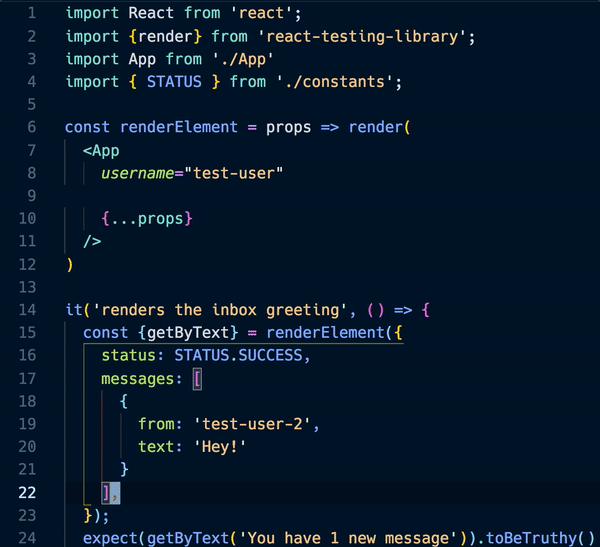

# [Convert Object <-> JSX for VSCode](https://marketplace.visualstudio.com/items?itemName=zachgawlik.convert-object-to-jsx)

Adds a command to convert between JS object and JSX prop formats

## Use

- Select a block of object entries or JSX props. Do NOT include the Component name or object braces in your selection
- Either
  - bring up the command palette (cmd+shift+p on mac) and select "Convert Object <-> JSX"
  - Or use the `ctrl+,` shortcut

## Configuration

You can change the keyboard shortcut by opening the Keyboard Shortcuts option in the command palette and modifying the entry for `extension.convertObjectToJsx`

Settings:

- `"convert-object-to-jsx.useJsxShorthand"`: Instead of `prop={true}` use `prop`

## TODO:

- [ ] Handle converting from a single-lined object with multiple entries
